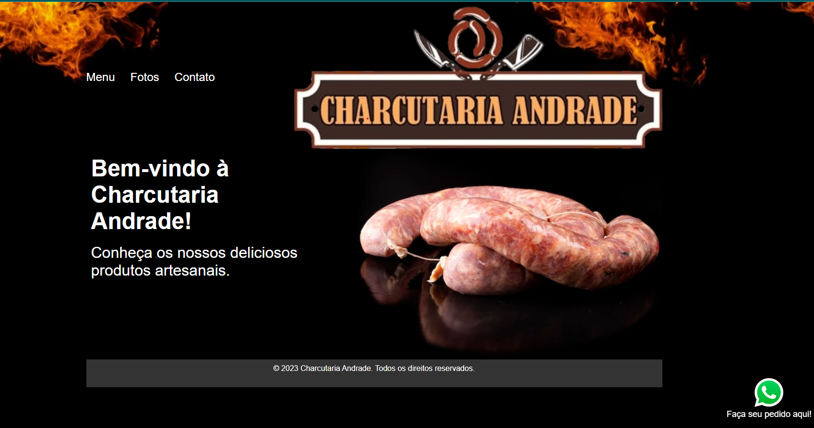
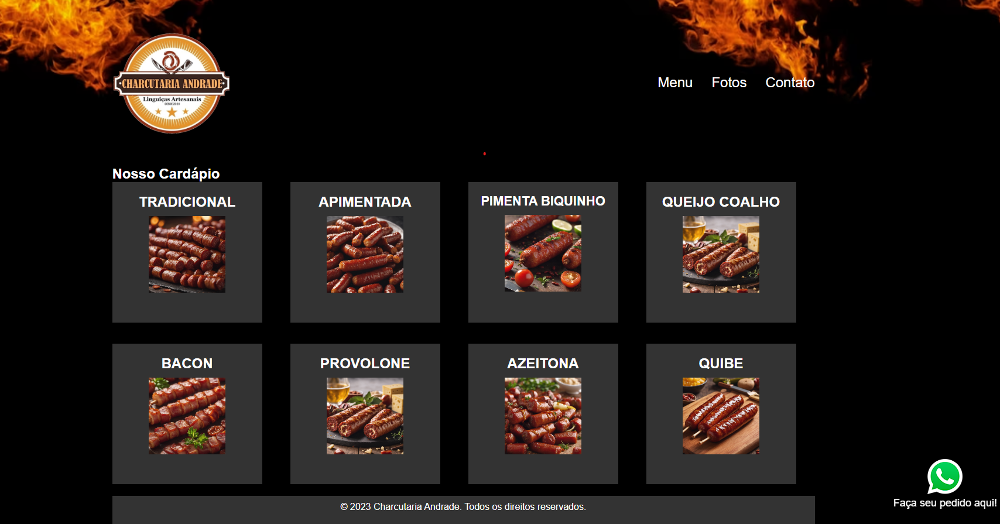
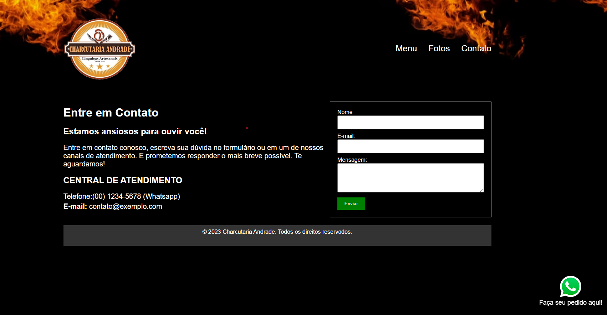

# Charcutaria Online

Este projeto consiste em um website simples desenvolvido para uma charcutaria, permitindo que os clientes visualizem os produtos disponíveis. O website é composto por várias páginas, incluindo uma página inicial, uma página de produtos e uma página de contato.

## Tecnologias Utilizadas

- HTML
- CSS

## Funcionalidades

- **Página Inicial**
  - Recepciona os visitantes da charcutaria.
  - Fornece informações básicas sobre o negócio.

- **Página de Produtos**
  - Exibe uma lista de produtos disponíveis.
  - Cada produto inclui uma imagem, descrição e preço.

- **Página de Contato**
  - Permite que os visitantes entrem em contato com a charcutaria.
  - Inclui um formulário de contato para envio de mensagens.

## Capturas de Tela

*Captura de tela da Página Inicial*

*Captura de tela da Página de Produtos*

*Captura de tela da Página de Contato*

## Uso

Para visualizar o website:

1. Clone o repositório.
2. Abra o arquivo `index.html` em seu navegador web.

## Contribuições

Contribuições são bem-vindas! Se encontrar algum problema ou desejar adicionar novas funcionalidades, sinta-se à vontade para enviar um pull request.

***

# Charcutaria Online

This project is a simple website developed for a charcuterie, allowing customers to view available products. The website consists of several pages including a home page, a products page, and a contact page.

## Technologies Used

- HTML
- CSS

## Features

- **Home Page**
  - Welcomes visitors to the charcuterie.
  - Provides basic information about the business.

- **Products Page**
  - Displays a list of available products.
  - Each product includes an image, description, and price.

- **Contact Page**
  - Allows visitors to get in touch with the charcuterie.
  - Includes a contact form for sending messages.

## Screenshots

*Screenshot of the Home Page*

*Screenshot of the Products Page*

*Screenshot of the Contact Page*

## Usage

To view the website:

1. Clone the repository.
2. Open the `index.html` file in your web browser.

## Contributing

Contributions are welcome! If you find any issues or would like to add new features, feel free to submit a pull request.

